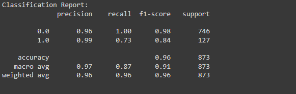

# Credit Card Fraud Detection

This project demonstrates a complete workflow for detecting fraudulent credit card transactions using an autoencoder and logistic regression.

## Overview

The goal of this project is to identify fraudulent credit card transactions based on various features such as transaction amount and time. The project uses an autoencoder for feature extraction and logistic regression for classification.

## Dataset

The dataset used in this project contains information about credit card transactions. The key features include:
- Time
- Amount
- Various anonymized features (V1, V2, ..., V28)
- Class (1 for fraud, 0 for normal)

## Model description

The model used in this project consists of two main components:

1. **Autoencoder**:
   - **Purpose**: The autoencoder is used for feature extraction. It learns to compress the input data into a lower-dimensional representation and then reconstruct it.
   - **Architecture**: The autoencoder consists of an input layer, two hidden layers for encoding, and two hidden layers for decoding. The output layer attempts to reconstruct the input data.
   - **Training**: The autoencoder is trained on non-fraudulent transactions to learn the normal patterns in the data.

2. **Logistic Regression**:
   - **Purpose**: Logistic regression is used as the classifier. It takes the lower-dimensional representation from the autoencoder as input and predicts whether a transaction is fraudulent or not.
   - **Training**: The logistic regression model is trained on the hidden representations of both normal and fraudulent transactions.

## Data Visualization

### Transaction Class Distribution

### Amount per Transaction

### Time of Transaction vs Amount by Class

### Accuracy

